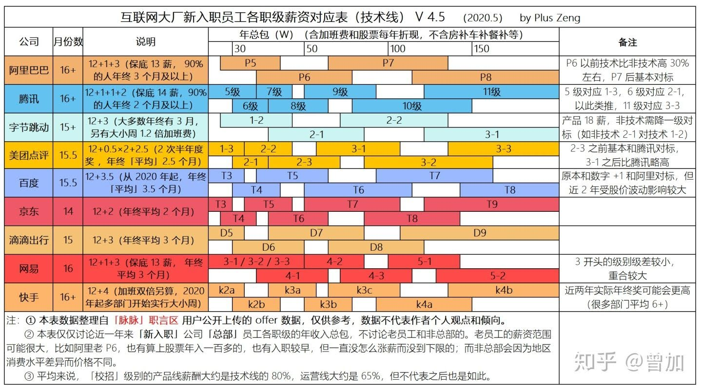

# 计算机学科

# 学科组成

https://www.cnblogs.com/fanzhidongyzby/p/3484815.html

## 知识领域

# 研究方向

各研究方向都有一些推荐期刊:

https://tech.163.com/19/0903/13/EO5D8VC000098IEO.html

# 国内高校对比

https://read01.com/Dn7OGAj.html#.Xx2OD0UzZPY

2019

## 普通大学

https://zhuanlan.zhihu.com/p/133478835

# 计算机专业课程体系

## 网易云课堂

# 相关职业

# 职业生涯

https://blog.csdn.net/foruok/article/details/85980126

[程序员加薪升职之成长金字塔](https://www.cnblogs.com/bellkosmos/p/5599409.html)

[技能金字塔](https://blog.csdn.net/muser_/article/details/84403524)

## 能力模型

### 高潜程序员胜任力 CPT9+X™模型

https://www.sohu.com/a/146477234_692408

## 专业知识结构

#### java架构师能力模型

https://youzhixueyuan.com/an-article-understands-the-architects-ability-model.html

# 薪资水平

https://blog.csdn.net/juwikuang/article/details/100551050

https://github.com/juwikuang/china_job_survey

[2019 年中国程序员薪资生存调查报告](https://zhuanlan.zhihu.com/p/58982730)

根据 Hired 《2019 年度薪酬状况报告》的统计，全球技术从业者的年薪平均涨幅为 5%，已到达 13.5 万美金（约 96 万人民币）。国内开发者受限于整体经济环境，较之平均水准有一定差距。

《2019 年中国程序员薪资生存调查报告》通过对北京、上海、广东和浙江等全国 29 个省、直辖市及特别行政区的 26 万程序员进行统计，发现程序员的年薪主要集中在 10-20 万之间，占比近五成，年薪在 5 万以下的仅占 4.2%。在高薪人群中，年薪在 25-30 万的占比 4.2%，30-40 万的占比 7.9%，40-50 万的占比 3.6%，50 万以上仍有占比 6.7%

## 城市

## 学历

## 工作经验

## 行业

## 各大厂职级

## 美国

https://www.chainnews.com/zh-hant/articles/206006458221.htm

# 编程语言/编程技能

## 国内

https://blog.csdn.net/juwikuang/article/details/100550704

## 世界范围内

